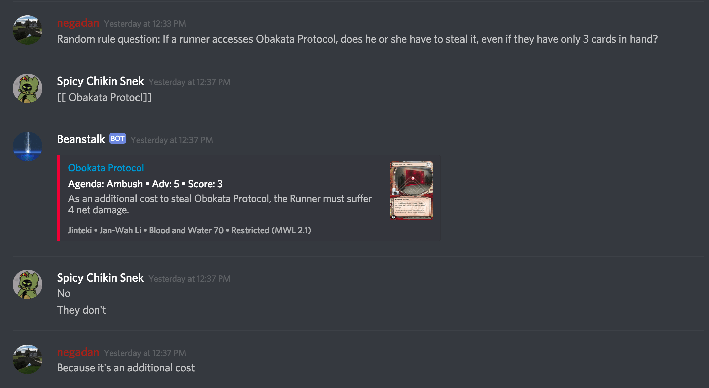
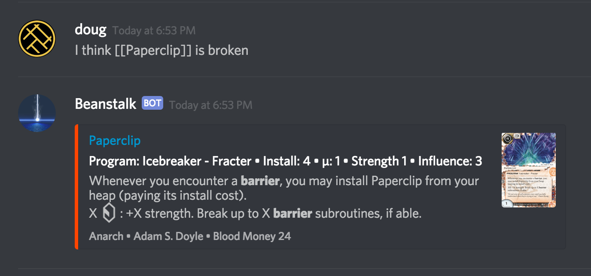
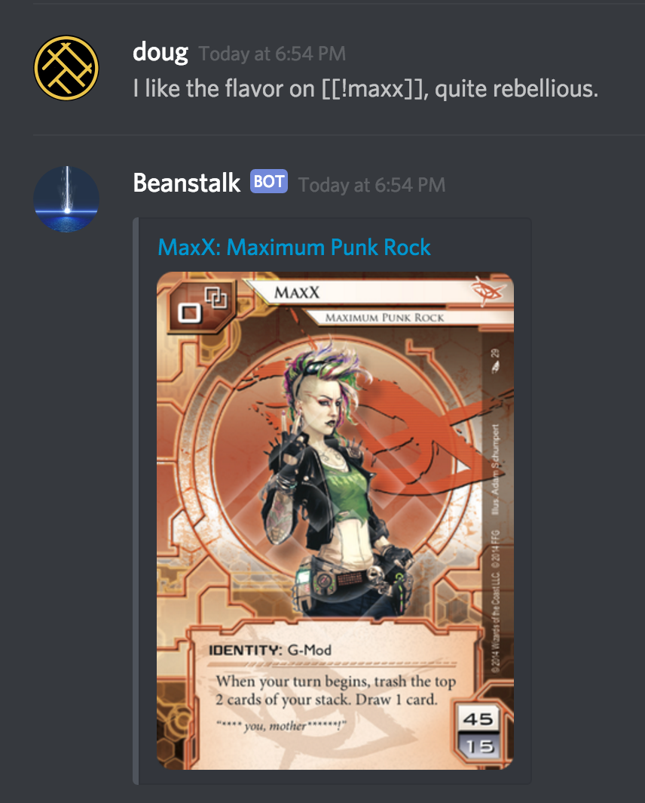

# Introducing Beanstalk: A Netrunner Discord Bot
#### Posted March 18, 2018

### Discord

A quick update: back in December I wrapped up a wonderful 4.5 years with
[Twilio][twilio] and joined the awesome team at [Discord][discord] as an
engineer on the Data Infrastructure team where we're currently focused on
scaling our data pipeline to keep up with Discord's rapid growth.

### Netrunner

I recently started [Android: Netrunner][netrunner], an asymmetric two-player
tabletop card game. It's a beautiful, complex, high strategy card game that I
highly recommend! I convinced a few friends to join me and we were soon talking
about Netrunner quite frequently in our own private Discord server.

However, our conversations would frequently involve a particular card and
because both of us are new enough as to not have each of the 1400+ cards in the
entire card pool memorized, we'd both need to go look up the text of the card
on [NetrunnerDB][netrunnerdb], which is an incredible community resource
maintained by the prolific [@alsciende][alsciende].

Having to constantly context switch between our conversation and a card
reference was mildly annoying, so I merged two mutual interests and created a
Discord bot that reads from the [NetrunnerDB API][netrunnerdb-api] and responds
with card text inline to automate that process for us, much like
[Scryfall][scryfall] does for Magic on Discord and Slack and like
[MTGCardFetcher][mtgcardfetcher] does for the Magic subreddit.

### Beanstalk

I named it Beanstalk. In the cyperpunk Netrunner universe, the
[Beanstalk][wiki-beanstalk] is a 70,000km tall space elevator that connects the
Ecuadorian megacity of New Angeles to Earth's orbit, revolutionizing the
world's economy.

Beanstalk's usage is simple. Simply put all or part of a card's name in double
square brackets and it will reply with the card's text in a nicely formatted
embed. For instance,

> I think [[Paperclip]] is broken

Alternatively, you can prefix the card text with an exclamation point and
Beanstalk will reply only with a full sized image of the card.

> I like the flavor on [[!maxx]], quite rebellious.

### Wrapping Up

Beanstalk's source is [up on Github][github], feel free to do with it as you
wish. To add it to your server click [this link][oauth]. Questions or comments?
Hit me up on Twitter at [@dougblackio][twitter] or join the [Beanstalk Discord
Server][beanstalk-discord].

Thanks again to [@alsciende][alsciende], who's great work on NetrunnerDB made
this simple little Discord bot possible.

Also, check out Netrunner! It's a fun, competitive game with a welcoming
community and a universe that's easy to fall in love with.

[alsciende]: https://twitter.com/alsciende
[beanstalk-discord]: https://discord.gg/cEpqnVz
[discord]: https://discord.com
[github]: https://github.com/dougblack/beanstalk
[mtgcardfetcher]: https://www.reddit.com/user/MTGCardFetcher
[netrunner]: https://en.wikipedia.org/wiki/Android:_Netrunner
[netrunnerdb-api]: https://netrunnerdb.com/api/doc
[netrunnerdb]: https://netrunnerdb.com
[oauth]: https://discordapp.com/api/oauth2/authorize?client_id=417880361905684490&permissions=1074055168&redirect_uri=https%3A%2F%2Fdougblack.io&scope=bot
[scryfall]: https://scryfall.com/
[twilio]: https://twilio.com
[twitter]: https://twitter.com/dougblack
[wiki-beanstalk]: http://android-universe-fan.wikia.com/wiki/Beanstalk
