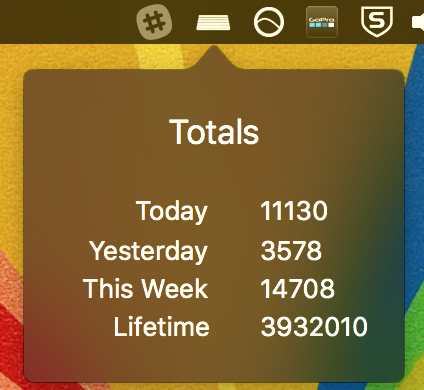

# Introducing Keylixer
#### Posted September 19, 2016

From time to time I'll leave the office, fingers a bit sore, and wonder:

> How much did I type today!?

A while back I sat down and decided to actually attempt writing an app to
answer this question for me. I use a Mac every day, so I figured this would be
a fun opportunity to learn a bit more about OS X development and that hot new
Swift language everyone's always talking about these days.

Out of that effort came Keylixer, a little OS X menu bar app that silently
counts all your keystrokes and happily displays a little report of your counts
from the last hour, day, week, and total lifetime keystrokes.

It requires some extra accessibility permissions to do its job, but I promise
it doesn't do anything nefarious with this information.

But don't take my word for it, go read the [source][source]. Contributions
welcome.

[source]: https://github.com/dougblack/keylixer
